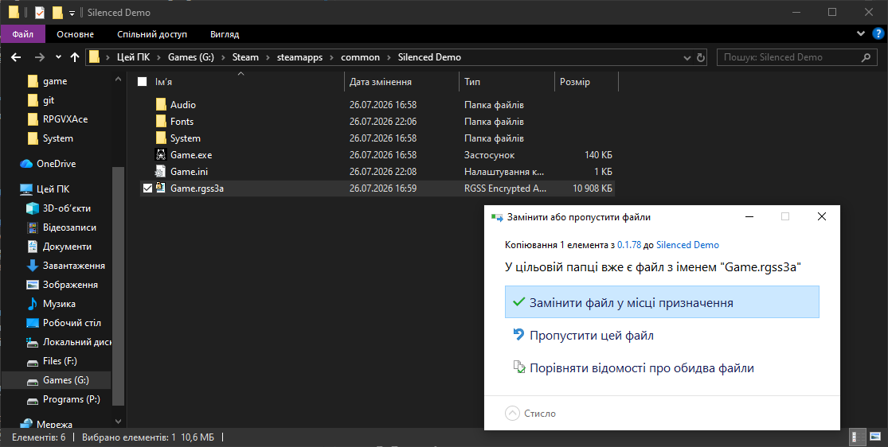
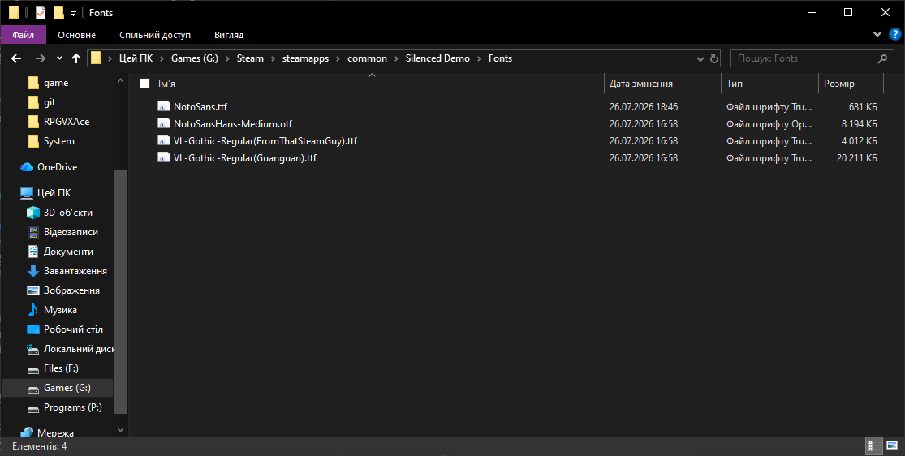
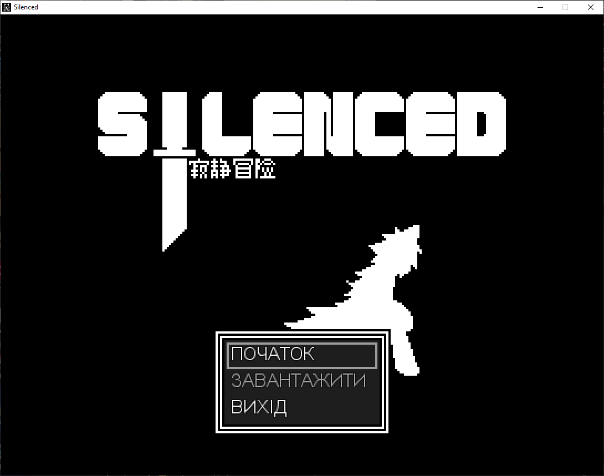
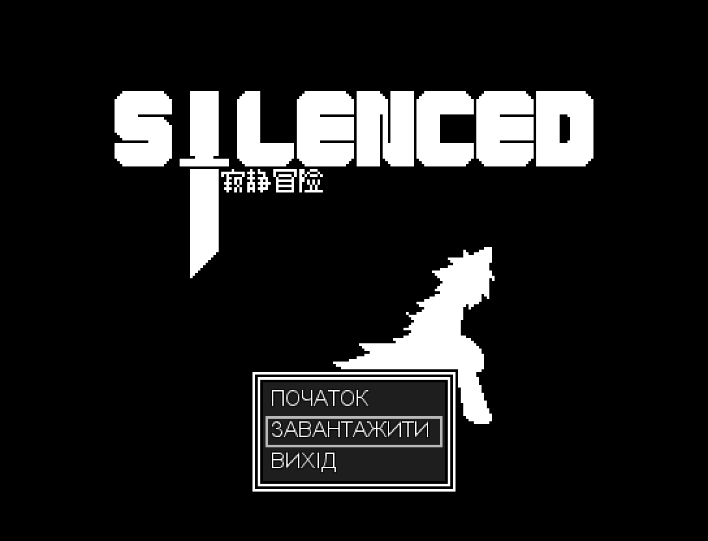
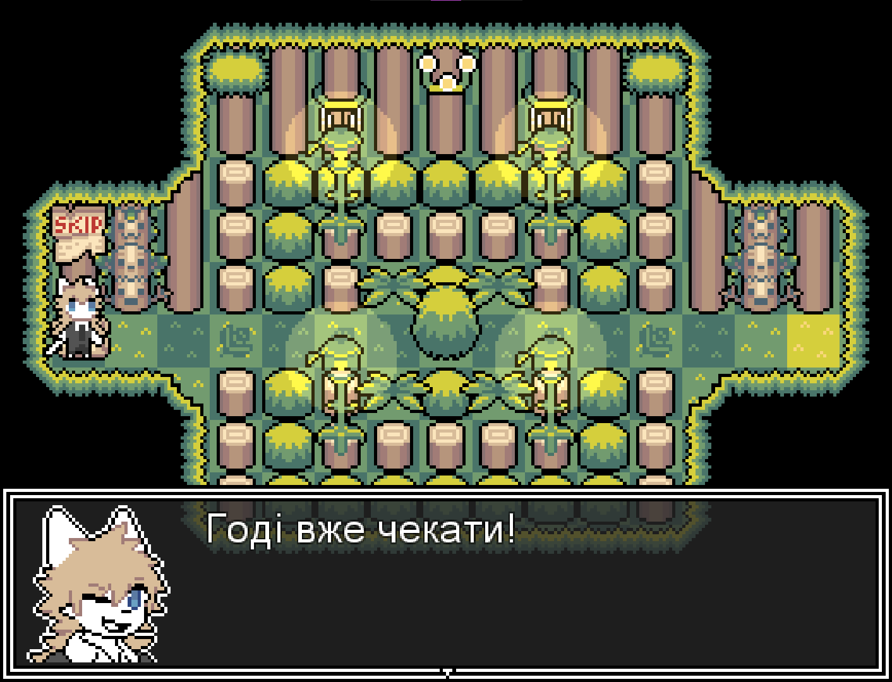
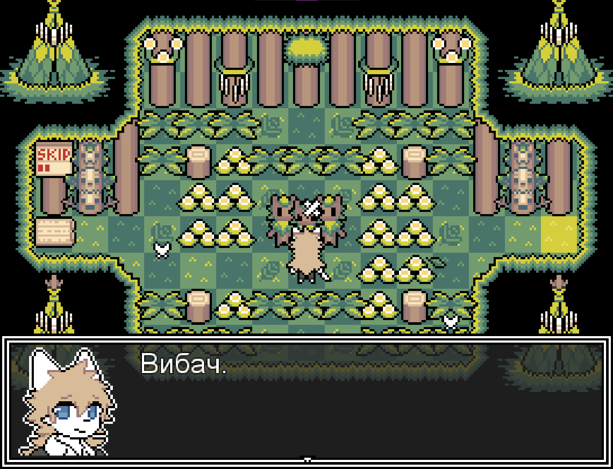
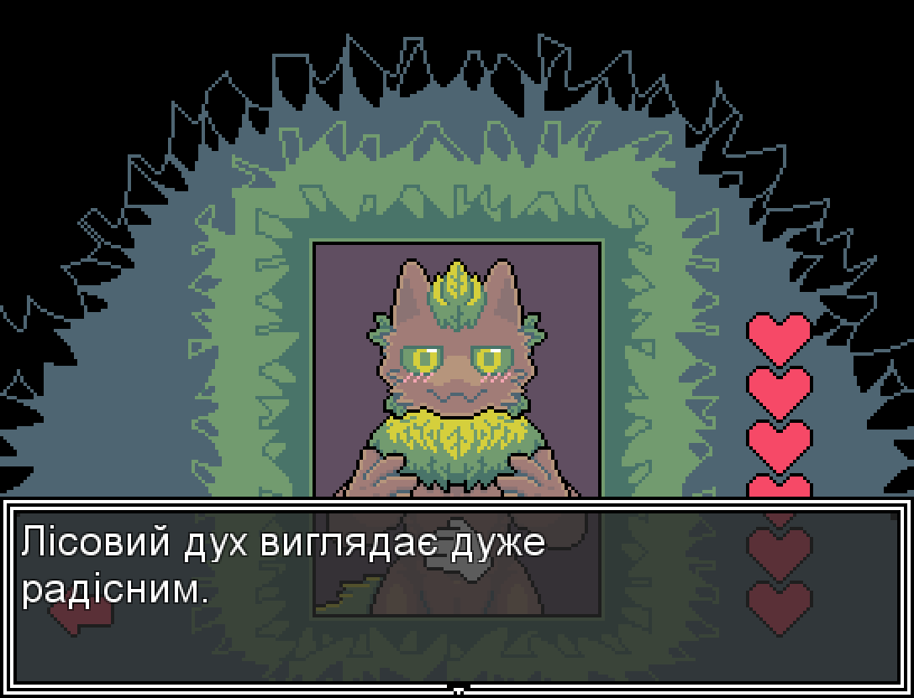
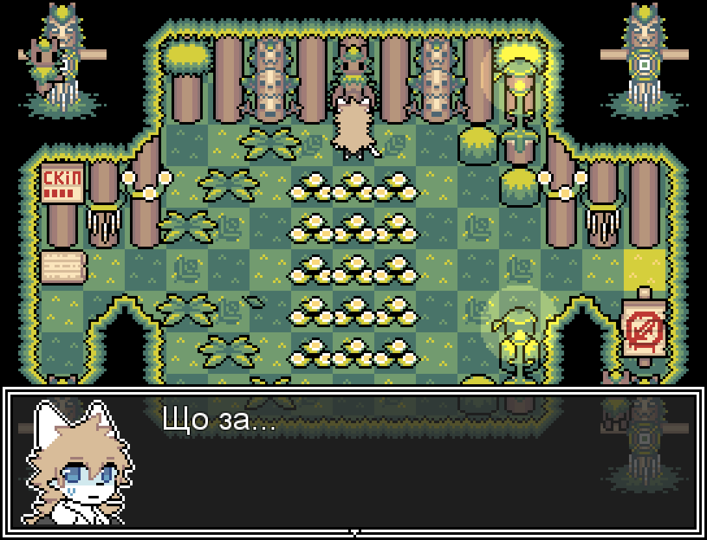
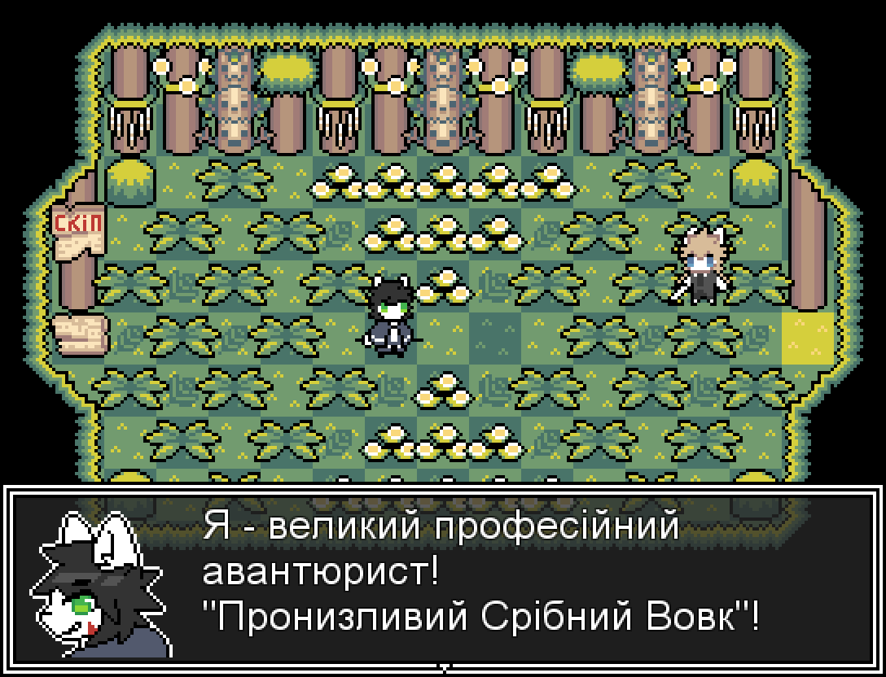
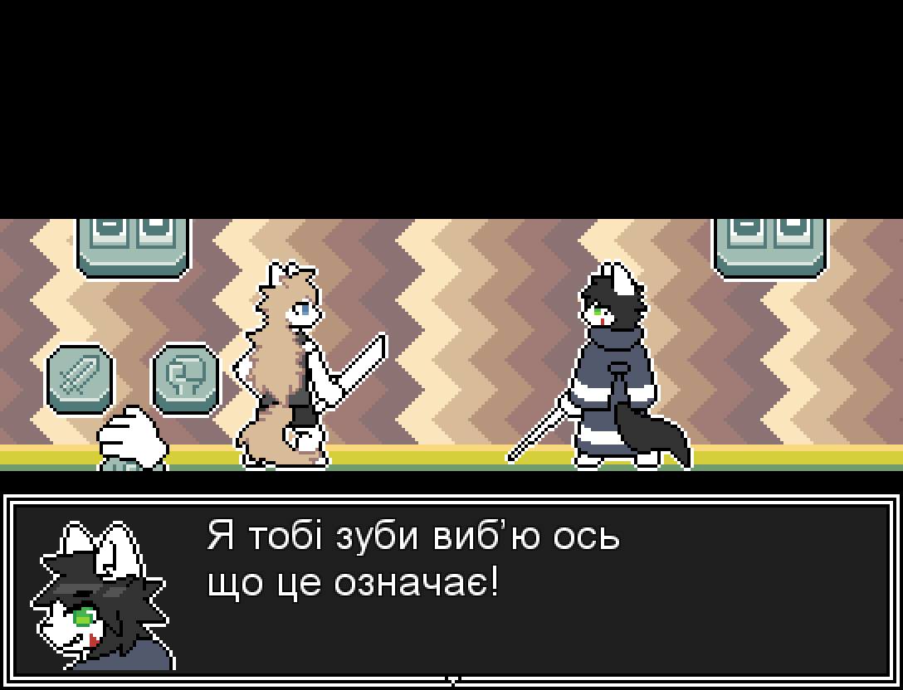

# Silenced Ukrainian Language

Українська локалізація для гри Silenced. У цьому репозиторії ви знайдете файли різних версій перекладу, скриншоти та інструкцію зі встановлення.

### Наразі найактуальніша версія - **0.2.179**. 

Завантажити її можна [тут](https://github.com/elik7777/GameSilencedUkrainianLanguage/raw/main/Version%20language/0.2.179/Game.rgss3a).

Файл шрифту [тут](https://github.com/elik7777/GameSilencedUkrainianLanguage/raw/main/Type/NotoSans.ttf).                  

### Ця гра е лише **демо**.
Переклад базується на версії гри 13 квітня 2026 року.

---

## Встановлення локалізації

### 1. Завантажте необхідні файли
* Завантажте файл [шрифту](https://github.com/elik7777/GameSilencedUkrainianLanguage/raw/main/Type/NotoSans.ttf)
* Перейдіть до [Таблиці версій](#таблиця-версій) та завантажте актуальний файл.

### 2. Замініть файли гри
* Відкрийте папку гри Changed. 
* Перенесіть завантажений файл `Game.rgss3a` у цю папку та підтвердьте заміну файлу.

* Перейдіть у папку `Fonts` та вставте туди файл [шрифту](https://github.com/elik7777/GameSilencedUkrainianLanguage/raw/main/Type/NotoSans.ttf).
`NotoSans.ttf`

### 3. Запустіть гру
  

---

## Таблиця версій

| Версія | Тип версії | Актуальна |
| :---: | :---: | :---: |
| [0.2.179](https://github.com/elik7777/GameSilencedUkrainianLanguage/raw/main/Version%20language/0.2.179/Game.rgss3a)  | Мод | + |
| [0.1.78](https://github.com/elik7777/GameSilencedUkrainianLanguage/raw/main/Version%20language/0.1.78/Game.rgss3a)  | Мод | - |

---

Якщо ви помітили помилку перекладу після версії 1.Х.Х: 

Напишіть [тут](https://github.com/elik7777/GameSilencedUkrainianLanguage/issues).

  
Переглянути скриншоти

  
   
  
  
  
  
  
  
  
  

